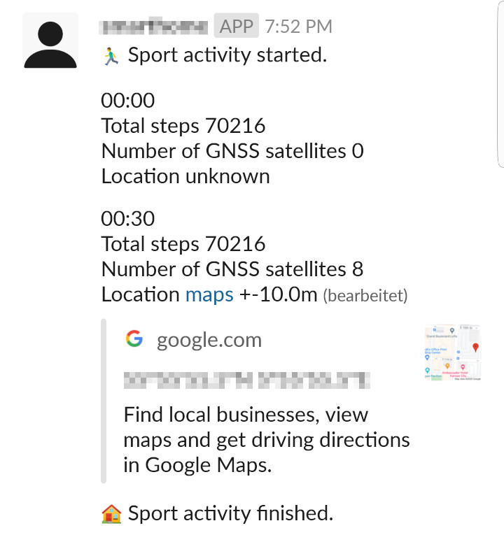
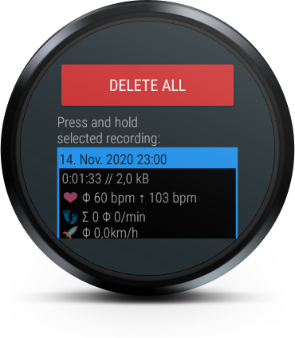
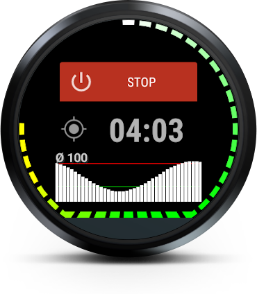

Tracker
=======

Tracker is an Android Wear (WearOS) app for recording sport activities, mostly jogging. Published under the  license.

Features
--------
- No cloud!
- Time measurement (pretty obvious :))
- Current heart rate graphically shown around the face
- History of last heart rate measurements shown as a bar graph
- Average heart rate shown numerically
- GNSS status shown as an icon
  - dark: no GNSS signal
  - magenta: one satellite (no position available)
  - red: two satellites (no position available)
  - yellow: three satellites (no position available)
  - white: three or more satellites, position available

- Sport activity events can be transmitted to a selected Slack channel
- The beginning and the end of a sport activity are announced
- Every 30 seconds a short summary is reported
  - Total amount of steps as reported by the sensor
  - Average speed if available (required GNSS signal)
  - Current heart rate
  - Current location (number of tracked satellites, GMaps-link, latitude, longitude and lateral accuracy)

- Data stored internally in the watch [File format](FILE_FORMAT.md)
- Possible to delete all or individual files via the UI
- Possible to send a selected file via the UI to a raw TCP socket (anything better still in development)
- Details of each recording
  - Date/time of the beginning of the activity
  - Duration of the activity (h:mm:ss)
  - File size in kB
  - Average and maximum heart rate (bpm)
  - Total steps and average steps per minute
  - GNSS-based data: average speed
  - Total ascent and descent have been removed as they introduced only confusion

- Configurable address and port for receiving files
  - Please note, private addresses (e.g. in your home network) will not work
- NEW Toggle reporting to a slack channel
  - Enter a slack authentication token (xoxb-...)
  - Enter a slack channel name (with the leading #)
  - Turn on reporting: a successful comminucation will be immerdiatelly confirmed
- Toggle recording of: heart rate, steps, GNSS data, air pressure
- Toggle display always-on

- Adjusted graphics for displays with a chin
- Adjusted graphics for square displays

Installation
------------
1. A compiled version of the WearOS app 
The app is available as Google Play open beta-testing. Please note, it is a little behind of the GitHub status as it takes time until a new version gets accepted. 
https://play.google.com/apps/testing/de.miltschek.tracker

1. A compiled version of the supporting apps 
The TcpServer and the TrackerDesktop (see below) will be available as compiled versions soon.

1. Do it by your own
    1. Download or clone the project from GitHub
    1. Open the project in [Android Studio](https://developer.android.com/studio)
    1. [Enable debugging on your watch](https://developer.android.com/training/wearables/apps/debugging#enable-dev-options)
    1. Connect the watch to your PC (common approach is [debugging via Bluetooth](https://developer.android.com/training/wearables/apps/debugging#usb-debugging)).
    1. The watch should be recognized by the Android Studio. Launch the app on the watch.
    1. Alternatively you can download a pre-compiled APK from GitHub (see: releases) and use the adb to install the app on the watch without having to compile it by your own (adb -s *android_serial* install myapp.apk). To get the serial id of the watch, print the list of devices by typing "adb devices".

Changes
-------
- Integration with Slack has been added.
- Total ascent and descent have been removed from the summary.
- Confirmation dialogs are nicer now.
- Individual files can be deleted.
- Files are sorted from the newest one to the oldest one.
- The file transfer protocol got changed, so you need to update both: the app and the TcpServer in order to get it working. The reason is a broken socket implementation on the WearOS. More here: [Weird TCP Sockets on WearOS](https://krzsztf.wordpress.com/2020/08/30/weird-tcp-sockets-on-wearos/)

Known issues
------------
- File upload is as minimalistic as possible at the moment. You need a TCP-socket server available on a public IP in order to get the data. Give me some time to make it better.
- File upload works only with public IP addresses due to the routing limitations of the WearOS proxy. With enough time a companion app could solve it.
- GNSS (GPS, Glonass, Galileo, whatever your watch does support) is, at least on my device, very inaccurate, so the calculated speed, ascent and descent is mostly to make you laugh instead of any real value.
- Air pressure sensor, similarly, gives such a noise, that is it not worth recording its data. Maybe some filter would help - need to analyze it.
- GNSS always-on is still buggy in the implementation, that's why the switch is disabled per default.

TcpServer
=========
Essential TCP server for receiving data uploads from the app.
Usage:
- main class: de.miltschek.TcpServer
- start: no arguments, bind address and port are interactively configured
- stop: enter 'quit' at any time
- files are written to the current directory and named data_<CURRENT_TIMESTAMP>.bin
- limitation: single threaded

TrackerDesktop
==============
Essential file converter for the binary data files.
Usage:
- main class: de.miltschek.tracker.TrackerConverter
- start: no arguments or a single argument = path to the input file (.bin)
- if no arguments are provided, a file selection dialog opens asking for an input file
- output file: KML (name and location queried in the dialog)
- output file: CSV (name and location queried in the dialog)
- short summary is printed out in the console
- please note: the CSV file will be generated accordingly to the current formatting locale settings of the host; depending on the language version of your Excel, it expects either a dot or a comma as a decimal separator

Blog
====

More on https://krzsztf.wordpress.com/
